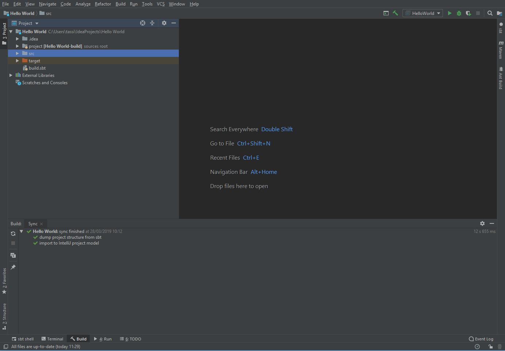
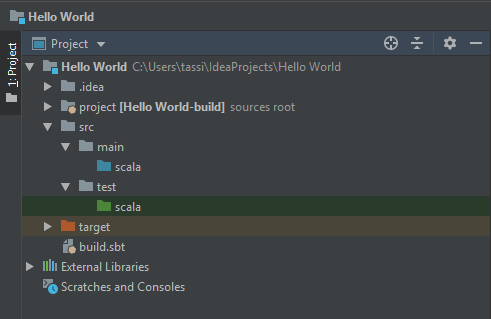
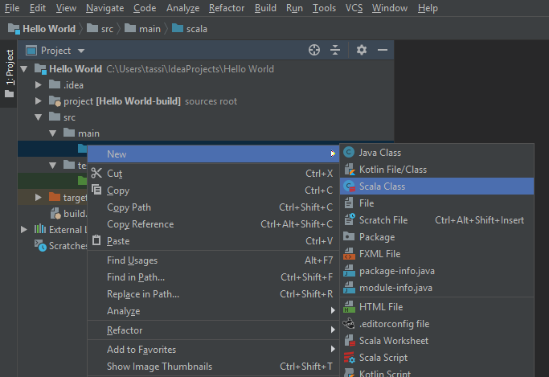
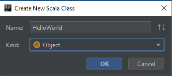
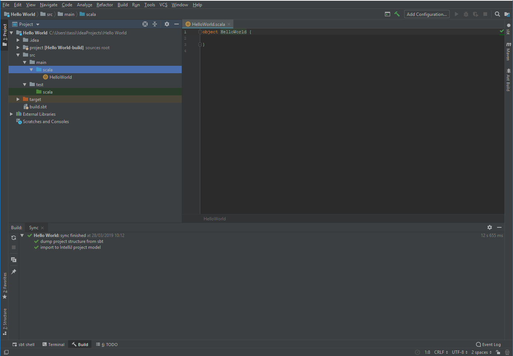
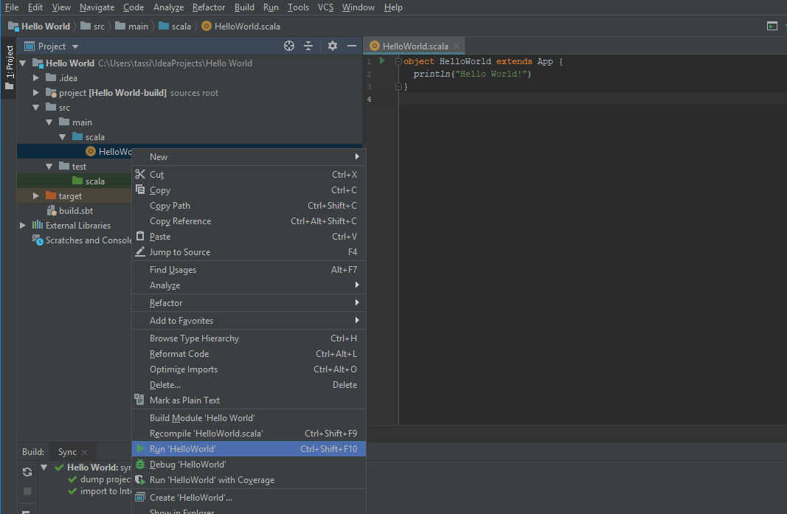
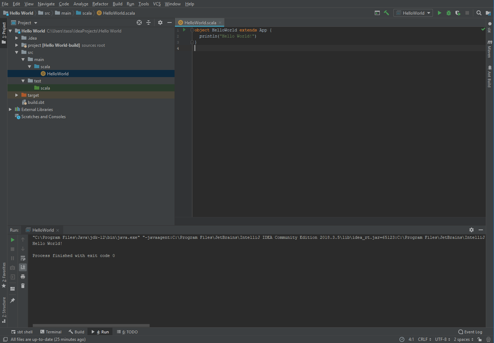
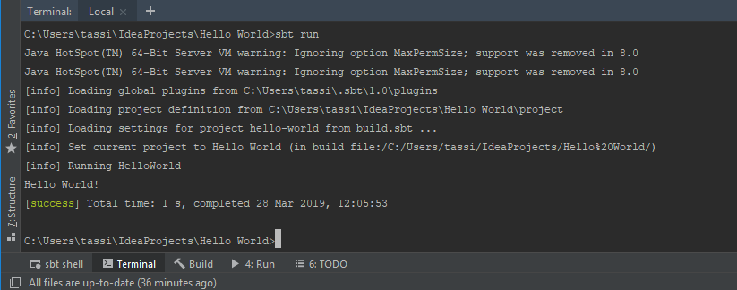

# Section 3
## Your first program

If all's gone well you should have IntelliJ installed with the Scala plugin, set the language framework to recongise Scala, and have a JDK. If so, well done! That's all the boring stuff out of the way, and now we're ready to start coding.

We're going to get going with a really simple program. It won't do very much, other than print out some text, but it's quite an acheivement to actually get something running. I'm going to follow the age old programmer's initiation rite of writing my first program to print out "Hello World!", but feel free to change it to print out whatever you like. In fact, one of the best ways of learning as you follow through these tutorials will be to understand what the code is doing, then play around and try to get it to do something slightly different.

First things first, open up IntelliJ and create a new project. Choose a Scala sbt-based project, and give your project a name. Im going to call mine `Hello World`. You get an option of where to save your project, but I'm just going to leave mine in the default directory. Click **Finish** and IntelliJ will open up your new project in  window that looks like this:



The **Project** tab on the left hand side is like Windows Explorer, or Finder on the Mac. It shows the structure of your project, with directories and files. Almost everything we do is going to be inside the **src** folder, so go ahead and open it up. You should find a structure that looks like this:



You can see that there are two Scala directories, one in blue and the other in green. When I'm talking about files or folders, if there's ambiguity about which one I mean I'll prefix them with enough of the path for it to be clear. So we've got a `src/main/scala` folder and a `src/test/scala` folder. I could also refer to these as `main/scala` and `test/scala` as that's enough to distinguish them.

All the code for our program is going to live in the `main/scala` folder. We're also going to be writing code to test that our program works properly. Can you guess where that is going to go? We want be writing any tests for this first program, but don't worry we'll be getting onto them very soon!

Right click on the `main/scala` folder, and choose **New -> Scala Class** as shown in the picture below. If the **Scala Class** option isn't there, make sure you've got the Scala framework support turned on by right clicking on your project name and selecting **Add framework support**.



In the **Create New Scala Class** pop up, change the Kind from Class to Object, and give it a name. If you want to follow along with me, call your new object `HelloWorld`. Note that the names of things in Scala can't have spaces in them, and object names should start with a capital letter. Most programming languages don't let you have spaces in names, and so have naming conventions to make it easier to read multi-word names. The convention in Scala is to use a capital letter for the beginning of each new word, but other languages might have different conventions such as putting an undescore between each word, like `Hello_world`.



IntelliJ should now look like this. You can see your new object in the project view, and the editor view has changed to show the new file you've created. The tab at the top of the editor view has the file name, and as you create more files you'll be able to move between them by selecting the different tabs, just as you do when moving between different tabs in your Internet browser.



The editor view shows the contents of the current file, which you can see isn't empty. IntelliJ has helpfully autogenerated some code to get you going. Your `HelloWorld.scala` file should contain the following code:

```
object HelloWorld {
}
```

Let's do some typing. Change the code so it looks like this:

```
object HelloWorld extends App {
  println("Hello World!")
}
```

And that's it, you've written your first program! It's not going to break the Internet, but we've got to start somewhere. The last thing to do is to run it. Right click on the HelloWorld file in the project view, and select **Run 'HelloWorld'**.



With a bit of luck it should switch the bottom window to the terminal view, and you should see your program greeting the world!



Admittedly it's not very pretty, but congratulations, you've written you're first program! Why don't you try making it say something else, or else printing a couple of greetings. We'll go into more detail about what the code means in the next chapter, so give yourself a pat on the back and take a breather.

### Troubleshooting

Sometimes things don't go quite according to plan. The first time I tried to run the program I ended up getting errors from IntelliJ. If this happens to you, try running the program directly from the terminal rather than how it was described above. To do this, click the **Terminal** tab near the bottom of IntelliJ to switch the bottom view to the terminal, then type `sbt run`. Hopefully you should see something like below.



If you're still having problems, you might need to resort to searching for the type of error you're getting on Google or [stackoverflow.com](https://stackoverflow.com). 
