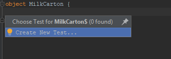
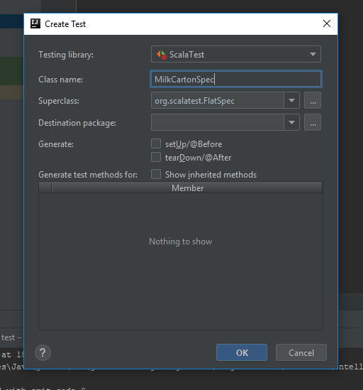

# Section 5
## More methods, and variables

Let's get some more practice with writing methods and tests. We'll continue with our project from the last chapter, so we should have an `Ian` object in the `src/main/scala` folder and an `IanSpec` class in the `src/test/scala` folder. I want to expand the behaviour of our `Ian` object so that it can introduce itself to other people by their name. This will be the first dynamic behaviour we code, whereby a method can return different things depending on what's passed into it. A well written test should be just as good at describing behaviour as written prose, so I'm going to go ahead and write down how I'd like this to work in a new test case. This will go in the class body of the `IanSpec` class. You can put it below the existing test case, so your file should look something like this:

```
import org.scalatest._

class IanSpec extends FlatSpec with Matchers {

  "SayHello" should "return 'Hello, I'm Ian'" in {
    Ian.sayHello() shouldBe "Hello, I'm Ian"
  }

  "SayHelloTo(name)" should "return 'Hello (name), I'm Ian'" in {
    Ian.sayHelloTo("Snoopy") shouldBe "Hello Snoopy, I'm Ian"
    Ian.sayHelloTo("Linus") shouldBe "Hello Linus, I'm Ian"
  }
}
```

You should have almost all the tools you need to write this on your own now. Remember, you can use IntelliJ to generate method definitions for you. If you do this, it will generate a name for your method parameter (it calls mine `str`), which will be highlighted within a red box. You can either press **Enter** to keep the name it choose for you, or you can type a new name. `str` isn't very descriptive, so I've changed it to `name`.

You might need a small hand with the method body. We're going to be referring to the method parameter when we're inside the body, inserting its value into the return string. There are multiple ways of manipulating strings. If you want to create a new string by joining two strings together you can use the `+` operator between them.

```
def joinStrings() = "Hello " + "Snoopy"
```

If we call `joinStrings()` it will return a single string with the value "Hello Snoopy".

```
def joinStringsWithParameter(name: String) = "Hello " + name
```

If we call `joinStringsWithParameter("Snoopy")` it will return a single string with the value "Hello Snoopy". But this method is now dynamic, and can change what it returns depending on what is given to it. We can call `joinStringsWithParameter("James Bond")` and we'll get back a single string with the value "Hello James Bond".

The method we're writing needs to insert a parameter value between the strings "Hello " and ", I'm Ian". We can use the `+` operator to join as many strings as we like, so something like `"Hello " + name + ", I'm Ian"` works perfectly well, but isn't that readable. A nicer way of doing this is called *string interpolation*, which means writing out the finished string as you'd like it to look, but referring to any parameters directly inside the string. The computer will see the string interpolation pattern and replace the parameter names with their values. The syntax for this is to write a small `s` immediately before the opening quotation mark for the string, and then prefix any parameter names within the string with a `$` sign. An example should help.

```
def interpolateStrings(name: String) = s"Hello $name, I'm Ian"
```

Not the most beautiful thing ever, but definitely more readable than using lots of `+`. (Joining strings with `+` is called *concatenation*, by the way).

Now you definitely have all the tools to make that test pass! Have a go at doing this yourself. My solution will be below.

### What d'you know?

Let's have a little recap of what you've learnt so far. You know how to set up new projects, how to install a test framework, how to run a program and where the computer looks for the entrypoint to the program, how to print stuff to the terminal, how to create objects, how to specify object  behaviour using methods, what *types* are, what method parameters are, how to call methods on objects, how to concatenate and interpolate strings, how to write and run tests, how to interpret test failures, what TDD stands for and how to do it, how to use IntelliJ to generate methods for you, and that your code is built on top of a ton of prexisting classes, objects and methods that you can look at with a **Ctrl + Click**.

Not bad!

### Back to methods

There are two more things I'd like to talk about before we leave learning about methods: multi-parameter methods and method overloading. So far we've only seen methods that take no parameters (like `def sayHello()`), or take a single parameter (`def println(x: Any)` or `def interpolateStrings(name : String)`). But what if we need to add up two numbers? Or take in integers representing red, green and blue values in order to render the right colour pixel for a game? Well fortunately methods can take more than one parameter, and it's really simple to do. Just separate the parameters with a comma. Let's make an example to get some practice.

I'd like to make a calculator object, that has methods that add and substract numbers. They will both take two integer parameters. The add method will return a new integer that is the sum of both the parameters, and the subtract method will subtract the second number from the first and return the result. Maths operations work the way you would expect. If you want to add two numbers, use the `+` operator. Use `-` if you want to subtract.

You should have the knowledge to do this on your own now. Remember to start with a test. We're going to be creating a Calculator class, so we'll want a new test file called CalculatorSpec. The test case for the `add` method should have a description along the lines of `"Add" should "return the sum of the two parameters" in { }`. You can use **Alt + Enter** to get IntelliJ to generate objects and methods for you (but remember it puts new objects in the test folder rather than the main folder, so you'll need to move it).

### Method overloading

When you call a method from somewhere in your code, the computer looks up the object the method is defined in, then looks up the specific method to call. As you've seen, an object can have more than one method in it. However, it doesn't just go by the method name to identify the right method. It also looks at the method parameter types. So you could have an object with lots of methods, all with the same name, but with differences in their parameter types, and the computer would still be able to tell them apart. For instance, it would be alright to have all of the following methods in the same object, and the computer could find the right one depending on the parameter types it is being called with:

```
object StuffWithMethods {

  def add(x: Int, y: Int) = x + y

  def add(x: String, y: String) = x + y

  def add(x: Int, y: String) = ???

  def add(x: Int) = ???
}
```

Just a word of caution though. Method overloading works when you've got different parameter types, but it doesn't work when only the parameter names or the method return types are different. You'd get errors if you tried to put these methods in the same object:

```
object WontWork {

  def add(x: Int, y: Int): Int = ???

  def add(a: Int, b: Int): Int = ???

  def add(x: Int, y: Int): String = ???
}
```

Try adding an overloaded method to your calculator object that will take two strings, and return them concatenated. Don't forget to write the test first!

Ok, let's just make sure we're still on the same page. You should have an `Ian` object looking like this:

```
object Ian {

  def sayHello() = "Hello, I'm Ian"

  def sayHelloTo(name: String) = s"Hello $name, I'm Ian"
}
```

A `CalculatorSpec` test class like this:

```
import org.scalatest._

class CalculatorSpec extends FlatSpec with Matchers {

  "Add" should "return the sum of two integers" in {
    Calculator.add(1, 2) shouldBe 3
  }

  "Subtract" should "return the difference between two integers" in {
    Calculator.substract(4, 3) shouldBe 1
  }

  "Add passing in strings" should "return the concatenated strings" in {
    Calculator.add("Hello", "World") should be "HelloWorld"
  }
}
```

And finally the implementation of the Calculator object should look like:

```
object Calculator {

  def add(x: Int, y: Int) = x + y

  def subtract(x: Int, y: Int) = x - y

  def add(x: String, y: String) = x + y
}
```

## Let's talk about state, baby

Sorry for the cheesy title! You might remember when we were talking about Object Oriented Programming that I said that objects can have attributes. For our example of a milk carton, these were things like its colour, the logo printed on it, and how much milk it currently contains. These are all things that programmers would say describe the state of an object. When we're modeling these objects in code, we might decide that some of thse attributes will never change, such as the colour. Other attributes are likely to vary over time, such as the amount of milk the carton currently contains. In programming-speak, attributes that can vary are called *mutable*, and are created using the keyword `var`. Those values that are fixed are called *immutable*, and are created with the keyword `val`.

We're going to demonstrate the use of mutable and immutable attributes by modeling our milk carton in code. It will have an immutable attribute to represent its colour, and a mutable attribute representing how much milk it contains. We'll then code the behaviour for pouring and adding milk in methods, and see how we can link these methods to change the state of the object. You can keep using the existing project, or create a new one if you like.

I'm going to show you a slightly different way of creating objects and tests, meaning you won't have to move the auto-generated object from the test folder to the main folder. Right click on the `src/main/scala` folder, and select **New -> Scala Class**. Change the kind to Object, name the object MilkCarton, and click **OK**. IntelliJ should open up your new MilkCarton object in the editor view. Put the cursor somewhere in the object body and press **Ctrl + Shift + T**. You should get a dropdown box with the option to create a new test:



Select this option, and you'll get a box pop up with some options for your new test. Make sure the class name is MilkCartonSpec and the Superclass says `org.scalatest.FlatSpec` and click **OK**:



And voila, IntelliJ has created a new test file for you in the right place! It's still not quite perfect for us though. We've got `class MilkCartonSpec extends FlatSpec` but you need to add `with Matchers`. If you type `Matchers` and it's in red, make sure it's being imported into the file. In other words, the first line of the file should be `import org.scalatest.{FlatSpec, Matchers}` or `import org.scalatest._`.

Right, we're ready to start writing some tests. First we're going to check that we can get the colour attribute out of the object. We reference attributes on objects in the same way that we reference methods on objects. The only difference being that attributes don't have parentheses after their name. It doesn't make much sense to pass a parameter into an attribute. Follow along with me as we write this first test.

```
import org.scalatest._

class MilkCartonSpec extends FlatSpec with Matchers {

  "The MilkCarton's colour" should "be white" in {
    MilkCarton.colour shouldBe "white"
  }
}
```

Hopefully that makes sense. Because we haven't defined the `colour` attribute on the MilkCarton object, IntelliJ is highlighting the word `colour` in red, as it can't work out what it's referring to. We know how to fix that! Put your cursor in the word `colour` and either **Alt + Enter** or click on the red lightbulb to get the options dropdown. Select **Create value 'colour'**, and IntelliJ will insert some code into your MilkCarton object for you:

```
val colour = ???
```

You can see the keyword `val`, which means we're creating an immutable attribute. Replace the `???` with the value we want our attribute to have, which in this instance is the string "white".

```
val colour = "white"
```

Go back to your test file and run the test, either by right clicking on the file name and selecting the option to run the test, or clicking somewhere in the test body and pressing **Ctrl + Shift + F10**. With a bit of luck you've got a passing test! Try changing either the expected value in the test, or the actual value in the object to make the test fail. Cool, now put it back so it's passing again. You've just created your first attribute, and tested that you can get it's value out of the object!

Now we're going to do something more complicated, but satisfying. I'd say this is going to be our first *real* coding that does something interesting! We're going to create a mutable attribute to represent the state of how much milk the carton currently holds. Then we're going to create methods that can either add or remove specified amounts of milk, and check that the state of the carton gets updated properly to reflect the new amount of milk it contains. How exciting!

We need to make a decision about how much milk the carton will contain when it is created. It makes sense to me that it will initially be empty. So let's write a test to make sure that a newly created carton contains no milk. The test case will be something like:

```
"A newly created MilkCarton" should "contain no milk" in {
  MilkCarton.millilitresOfMilk shouldBe 0
}
```

Use IntelliJ to generate the attribute for you, but this time instead of selecting **Create value**, select **Create variable**. This is because we want a `var` instead of a `val`, which will let us change its value over time. Set your new variable to equal 0, like this:

```
var millilitresOfMilk = 0
```

And make sure your test passes. Now we need a way of adding milk, which is going to be a method. The way we're going to test that this method works is to call it to add milk, then check that the value of the millilitresOfMilk is equal to the amount of milk we added. So I'm going to add a new test case, like this:

```
"Adding milk" should "update the state of the MilkCarton" in {
  MilkCarton.millilitresOfMilk shouldBe 0
  MilkCarton.addMillilitresOfMilk(500)
  MilkCarton.millilitresOfMilk shouldBe 500
}
```

We start by making sure that the MilkCarton is empty. Then we call the method to add 500 mls of milk. And finally we check that the MilkCarton contains 500 mls of milk. Go ahead and get IntelliJ to generate the `addMillilitresOfMilk` method for you. This is how we are going to use the method to update the state of the carton:

```
object MilkCarton {

  var millilitresOfMilk = 0

  def addMillilitresOfMilk(mls: Int) = millilitresOfMilk = millilitresOfMilk + mls
}
```

Run your test and make sure that it passes, then we'll come back to this. It looks a little bit confusing, doesn't it. The first thing to say is that `=` doesn't mean equals in the way you learnt it at school. In maths we'd say `1 + 1 = 2`, which is testing that the left side is the same as the right side. In Scala (and many other programming languages) the `=` sign is used for assignment. It means *assign the value on the right hand side to the variable or method on the left hand side*. So `var millilitresOfMilk = 0` means assign the value 0 to the variable called millilitresOfMilk. In our `addMillilitresOfMilk` method, the first `=` means assign everything on the right hand side to the body of the method. It might look a little clearer if I rewrite it with the optional braces around the method body:

```
def addMillilitresOfMilk(mls: Int) = {
  millilitresOfMilk = millilitresOfMilk + mls
}
```

In the method body, the first `millilitresOfMilk` on the left hand side of the `=` is referencing the `var millilitresOfMilk`. The `=` means assign the result of the right hand side to the millilitresOfMilk variable. It's a bit confusing because millilitresOfMilk is on both sides. My fingers are beginning to regret calling that variable millilitresOfMilk. Let's change it to be a bit simpler. If we wrote:

```
millilitresOfMilk = 1 + 2
```

you could see that we're assigning the value 3 to the millilitresOfMilk attribute. If we wrote:

```
def addMillilitresOfMilk(mls: Int) = {
  millilitresOfMilk = 1 + mls
}
```

and we called the method passing in a parameter of 10, the computer would see that we're referencing the mls parameter on the right hand side, go get the value of that parameter (10), add it to 1 to get 11, and assign that to the millilitresOfMilk attribute. So going back to our original method:

```
def addMillilitresOfMilk(mls: Int) = {
  millilitresOfMilk = millilitresOfMilk + mls
}
```

and say we call the method with a parameter of 10, the computer will evaluate the expression on the right hand side of the `=` by finding the current value of the millilitresOfMilk variable (0), finding the value of the `mls` parameter (10), adding them together to get 10, and assigning that result back to the millilitresOfMilk attribute. If we then called the method again with a value of 10, the current value of the millilitresOfMilk. To illustrate this, let's update our test to show it in action:

```
"Adding milk" should "update the state of the MilkCarton" in {
  MilkCarton.millilitresOfMilk shouldBe 0

  MilkCarton.addMillilitresOfMilk(10)
  MilkCarton.millilitresOfMilk shouldBe 10

  MilkCarton.addMillilitresOfMilk(10)
  MilkCarton.millilitresOfMilk shouldBe 20

  MilkCarton.addMillilitresOfMilk(50)
  MilkCarton.millilitresOfMilk shouldBe 70
}
```

You can see that the carton is keeping track of how much milk it contains, and each time we add some it updates itself with the new value. Updating a variable by adding something to its existing value is such a common thing that there's actually a shortcut way of writing it, using the `+=` operator. So instead of:

```
millilitresOfMilk = millilitresOfMilk + mls
```

we can write:

```
millilitresOfMilk += mls
```

You can also use this shortcut for subtraction, multiplication and division. Here's a little self-contained program that you can run to demonstrate this.

```
object MyProgram extends App {

  var x = 10

  x += 100
  // x now equals 110

  x -= 10
  // x now equals 100

  x /= 2
  // x now equals 50

  x *= 4
  // x now equals 200

  println(x)
}
```

This will only work with mutable variables (`var`), not with immutable values (`val`), as once a `val` has been assigned a value it can't be changed.

### A comment on comments

You probably noticed something new in the little program above. There are lines of text beginning with a double forward slash `//`. These are *comments*, which is a way of writing text for humans to read in your program, but which the computer will ignore. Anything after a `//`, but on the same line, is treated as a comment. So I could have written:

```
x += 100 // x now equals 110
```

If you want to write comments that go over multiple lines, you start the comment with `/*`, and finish it with `*/`, like so:

```
object MyProgram extends App {

  /*
    This comment
    goes over
    several lines
  */
}
```

### Back to milk

Just to make sure we're in the same place, we should now have a MilkCartonSpec test file that looks like this:

```
import org.scalatest._

class MilkCartonSpec extends FlatSpec with Matchers {

  "The MilkCarton's colour" should "be white" in {
    MilkCarton.colour shouldBe "white"
  }

  "Adding milk" should "update the state of the MilkCarton" in {
    MilkCarton.millilitresOfMilk shouldBe 0

    MilkCarton.addMillilitresOfMilk(10)
    MilkCarton.millilitresOfMilk shouldBe 10

    MilkCarton.addMillilitresOfMilk(10)
    MilkCarton.millilitresOfMilk shouldBe 20

    MilkCarton.addMillilitresOfMilk(50)
    MilkCarton.millilitresOfMilk shouldBe 70
  }
}
```

And a MilkCarton file that looks like this:

```
object MilkCarton {
  val colour = "white"

  var millilitresOfMilk = 0

  def addMillilitresOfMilk(mls: Int) = millilitresOfMilk += mls
}
```

Try adding a method to remove milk from the carton. You might want to call it `pourMillilitresOfMilk`, and it should take an integer as a method parameter specifying how much milk to remove. Remember to write a test for it first.

And that's it for this chapter! Well done, you've made great progress in learning the building blocks of Object Oriented Programming. You know how to create objects, how to give them attributes that may or may not be allowed to change, and how to use methods to describe the behaviour of and change the state of objects. This is exactly how a computer game might track and update the state of characters. You'd probably have an object representing the player's character. Some of the player's attributes might not change, such as its walking speed, or the image used to display it, so these could be modelled using `vals`. Others will need to change throughout the course of the game, such as the amount of health it has, or the number of coins it has picked up, so these would be `vars`. And the state of the player would be updated by calling methods on the player object. For instance, you can imagine a `def takeDamage(x: Int)` method that would update the player's health.  There are a few more concepts to learn before you can make that big budget role playing game, but you're well on your way!

Try writing a `Player` object with some health that you can take from and add to using methods.