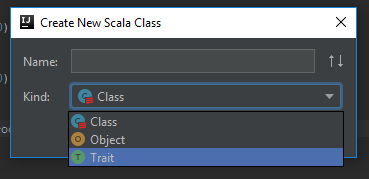

# Section 6
## Classes

I'd like to continue our example from the last section in which I asked you to create a `Player` object, in order to cover another crucial aspect of Object Oriented Programming. You can use your own `Player`, or copy mine. Just make sure it has a `var` representing its health as an integer, a `val` representing the amount of damage it can deal, and methods to take damage and to heal. Mine looks like this:

```
object Player {
  var health = 100
  val damage = 10

  def takeDamage(x: Int) = health -= x

  def heal(x: Int) = health += x
}
```

Now lets say we want to create a fantastic game, where the player goes around fighting monsters. I'm going to write a `Monster` object. It will be a bit less powerful than the player, so I'll give it less health and damage. Also, we don't want it to be able to heal. So it looks something like this:

```
object Monster {
  var health = 50
  val damage = 5

  def takeDamage(x: Int) = health -= x
}
```

There's obviously a lot missing if this was going to be a real game, such as being able to tell when the health has got down to zero and killing either the player or the monster, but I'm going to keep things simple.

A fight between the player and the monster could look like this:

```
object Game extends App {
  // Player hits first
  Monster.takeDamage(Player.damage)
  println(s"Monster now has ${Monster.health} health"

  // Monster's turn
  Player.takeDamage(Monster.damage)
  println(s"Player now has ${Player.health} health")
}
```

There's something slightly new here. Notice the curly braces around `{Monster.health}` and `{Player.health}`. This is still string interpolation, like we did before (`s"Hello $name"`), but if you're interpolating anything more than a simple variable you need to wrap it in curly braces. Try removing them and see what happens.

So that's great. We could keep getting the player and the monster to take turns hitting each other until the monster is dead. Hooray! But then the player is going to go exploring some more, and guess what's in the next room in the dungeon? That's right, another monster. Hmm, how do we handle this? With the tools we've currently got I can think of two ways of doing this. We've got a `Monster` object with zero health, and we have access to its health attribute, so we could just reset the health to 50:

```
Monster.health = 50
```

But what if we want the player to fight multiple monsters at once? Or if the player ran away from the first monster before it was dead, fought the second monster, then went back to fight the first monster? We'd be in a whole world of pain trying to keep track of how much health the `Monster` obejct should have at any given time.

The second option would be to write a separate object for each monster. Then each object will hold its own state, and we don't need to worry about tracking that ourselves. This might seem reasonable at first, but I'm intending to write a huge, open world game, with thousands of monsters to fight. I don't really want to have to write a thousand object files for these monsters.

Fortunately you're about to learn the magic trick that makes this really easy! Going back to our trusty milk carton analogy, we've said that a carton is an object. But that carton is getting made in a factory according to a set of instructions. Given those instructions and the factory, we can create as many carton objects as we like, each of which can have their own state (for instance holding different amounts of milk). Sounding similar to the problem we had with our monsters? Who would ever have thought that monsters and milk cartons have something in common?

Most OOP languages, including Scala, provide the factory mechanism for you to create new objects from instructions. And those instructions are called **classes**. Classes look very similar to objects. Let's rewrite our monster object as a class to see:

```
class Monster {
  var health = 50
  val damage = 5

  def takeDamage(x: Int) = health -= x
}
```

Spot the difference? We've replaced the word `object` with the word `class`. Make sure you've *replaced* your monster object with the class, not just created a class as well. It's ok to have an object and a class called the same thing, but I won't be able to demonstrate my point if you've got both at the moment.

Look back in your Game object, and IntelliJ should be complaining about not being able to resolve the symbol `Monster`. Remember that a class is *instructions* for how to create an object, not an object itself. It wouldn't make sense to ask the instructions for creating a milk carton how much milk it currently holds, or to pour some milk. So in our program we can't ask the instructions for creating a monster to take some damage. We need to use the instructions to create a monster object. And the way we ask Scala to create a new object for us is to use the word `new`. I'm going to rewrite the `Game` object to show you.

```
object Game extends App {
  // Create a new monster and assign it to a value
  val firstMonster = new Monster

  // Create another new monster and assign it to a different value
  val secondMonster = new Monster

  // Fight!!!
  firstMonster.takeDamage(Player.damage)
  secondMonster.takeDamage(Player.damage)
  firstMonster.takeDamage(Player.damage)

  println(s"firstMonster has ${firstMonster.health} health remaining") // 30 health left
  println(s"secondMonster has ${secondMonster.health} health remaining") // 40 health left
}
```

Brilliant! We're now able to create monsters willy-nilly, and they'll each maintain their own state of how much health they've got.

### Setting attributes when newing up

The technical term for creating a new object from a class is *instantiating*. "I'm going to instantiate a new monster". When I worked at Sky my team there used to say, "I'm going to new up a monster" instead. It's kind of cute. Use whichever you like!

It's useful to be able to set attributes on objects when you create them. There might be a standard set of instructions for creating a milk carton, but the same factory should be able to print different "Best before" labels on it. For my monsters I'd like to have some variation in the amount of damage they cause, so as I create each one I'm going to specify its damage. To do that we need to remove the `val damage = 5` attribute from the class, and pass it in as a constructor parameter instead. Constructor parameters are pretty similar to method parameters. They have names, types, and go in parentheses after the class name. Here's how the monster looks with a constructor parameter for its damage:

```
class Monster(damage: Int) {
  var health = 50

  // Methods omitted
}
```

And to create a monster object with a damage of 10, we would write:

```
new Monster(10)
```

Constructor parameters by default are `val`. In other words, once the object has been created the value can't be changed. We can create mutable constructor parameters as well, by specifying them as `var`. So to enable us to vary the starting health of the monsters as well, we'd remove the `var health = 50` attribute from the class and add a constructor parameter like so:

```
class Monster(damage: Int, var health: Int) {
  // Methods omitted
}
```

And to create a monster object with a damage of 10 and a health of 20, we would write:

```
new Monster(10, 20)
```

So with our new constructor parameters, let's update our game:

```
object Game extends App {
  // Create a weakling monster
  val ghost = new Monster(2, 10)

  // Create a powerful monster
  val dreadLord = new Monster(100, 1000)
}
```

### Named and default constructor parameters

Sometimes it makes sense to have default values for some of your constructor parameters, which means you don't have to specify them when you new up the object. For instance, I might decide that most of my monsters will have 5 damage and 10 health, and only a few special monsters will have different values. By specifying defaults, I'll be able to create most of my monsters by just typing `new Monster`, rather than having to type `new Monster(5, 10)` all the time. You can specify defaults just by assigning a value to the parameter in the constructor. So the constructor for my new monster class would look like:

```
class Monster(damage: Int = 5, var health: Int = 10)
```

I can now create new monsters with both default parameters, and also override one or both of the values:

```
new Monster // Has damage 5, health 10
new Monster(20) // Only overriding the first parameter, so has damage 20, health 10
new Monster(20, 50) // Overriding both parameters, so has damage 20, health 50
```

If I just want to override the second parameter, how do I specify that the first should stay as the default? I can name the parameters when I'm calling them:

```
new Monster(health = 30) // Only overrides the health parameter, so has damage 5, health 30
```

### Traits

We've learnt about objects, which have attributes and behaviour, and about classes, which allow us to create objects. The final part of the OOP triumvarate is **traits**. You might recognise the term. In fact, you've seen it several times already. When you create a new Scala file you have to choose the kind from the dropdown list. The available options are: Class, Object and Trait.



Traits allow us to specify that classes (and hence objects) will have certain attributes and behaviours, but not necessarily have to say what those attributes and behaviours are. That probably sounds a little confusing, so let's have an example. I love examples!

I want to have another type of enemy for our player to fight - a wizard. Now because the wizard is magical it doesn't have any health, but it has magic instead. It can still be attacked, but the attacks will reduce its magic rather than its health. So it will look something like this:

```
class Wizard(damage: Int = 10, var magic: Int = 50) {
  def takeDamage(x: Int) = magic -= x
}
```

And just for reference, our monster class looks like:

```
class Monster(damage: Int = 5, var health: Int = 10) {
  def takeDamage(x: Int) = health -= x
}
```

And just for the fun of it, lets create something else that we can damage:

```
class WoodenCrate(isBreakable: Boolean = false) {
  def takeDamage(x: Int) = {
    if (isBreakable) println("Bam! I've been smashed!")
    else println("Hah! Your puny blows mean nothing to me!")
  }
}
```

Don't worry about the implementation of the `WoodenCrate`. There's some stuff in there we'll learn about shortly. The thing to notice is that all three classes have a `takeDamage(x: Int)` method, but the method bodies do different things.

One other change I'd like to make is that the `Game` object currently has to know about how the player attacks the monster. I think the player should know how to do that itself. So I want the game to look like:

```
object Game extends App {
  val ghost = new Monster

  Player.attack(ghost)
}
```

`Player` doesn't have an `attack` method yet, so we'll have to write one. Try and do this yourself, and write a test in the `PlayerSpec` class first. I'll give you some hints below, and then my solution below that.

#### Hints

- The `attack` method will have a method parameter of type `Monster`. 
- You'll need to call the monster's `takeDamage` method from the body of the `attack` method. 
- You can reference the player's `damage` attribute from the method body just by calling it by name.
- To test that it's working create a monster with a known amount of health, attack it, then check that its health has been reduced by the player's attack value.

#### My implementation

New test in PlayerSpec:

```
"Attacking a monster" should "reduce the monster's health by the value of the player's damage" in {
  val x = new Monster(health = 50)
  Player.attack(x)
  x.health shouldBe 40
}
```

New method in Player:

```
object Player {
  var health = 100
  val damage = 10

  def attack(monster: Monster) = monster.takeDamage(damage)

  // Omitted other methods
}
```

Hopefully that makes sense. You're passing an object of type `Monster` into the player's `attack` method. In the method body you're calling the `takeDamage` method on the monster object, and passing in the value of the player's `damage` attribute. The body of the monster's `takeDamage` method subtracts the value passed into it from the monster's `health` attribute.

#### Back to the game

Great, now that the player can attack a monster, I'd like them to be able to attack Wizards and WoodenCrates as well. I can't just write:

```
val wiz = new Wizard
Player.attack(wiz)
```

Give it a try. It's not working because we've written the `attack` method to expect a method parameter of type `Monster`, and we're trying to pass it an object of type `Wizard`. You know about method overloading, so one solution would be to write separate `attack` methods for Wizards and WoodenCrates. That would look like this:

```
object Player {
  var health = 100
  val damage = 10

  def attack(x: Monster) = x.takeDamage(damage)
  def attack(x: Wizard) = x.takeDamage(damage)
  def attack(x: WoodenCrate) = x.takeDamage(damage)

  // Omitted other methods
}
```

There's some very similar looking code here. I've renamed the method parameters to `x`, just to highlight how similar the three methods are. In fact, their method bodies are identical. This is manageable when we've got three attackable object types, but not so great if we've got a dozen, or a hundred. Here's where traits come in. As I've said,

"Traits allow us to specify that classes (and hence objects) will have certain attributes and behaviours, but not necessarily have to say what those attributes and behaviours are."

We're going to use a trait to specify that our three classes all have the `takeDamage` behaviour, but let the classes specify what those behaviours are themselves. This is really easy to do. Right click on the `/src/main/scala` folder and select **New -> Scala class**. In the popup box, select **Trait** as the kind, and name it `Attackable`. Add the following to the trait body, so the file looks like this:

```
trait Attackable {
  def takeDamage(x: Int)
}
```

Here we've just got the method definition, and not the method body. In other words we've described a behaviour, but not how that behaviour should work. There are two things we need to update to make this work: the `Player` object to use the trait instead of the object types, and the attackable objects so the computer can associate them with the trait. I'll update the player first. You can remove the three `attack` methods, and replace them with this:

```
def attack(x: Attackable) = x.takeDamage(damage)
```

Here we're saying that the method should take a method parameter of type `Attackable`. And we know that `Attackable` types will have a `takeDamage` method, so it's safe to call `takeDamage` on the parameter in the method body. Now lets update our three classes so that the computer knows they are `Attackable` types. We do this by **extending the trait**, which just means writing the word "extends" followed by the trait name at the end of the class definition, like so:

```
class Monster(damage: Int = 5, var health: Int = 10) extends Attackable {
  // class body
}
```

```
class Wizard(damage: Int = 10, var magic: Int = 50) extends Attackable {
  // class body
}
```

```
class WoodenCrate(isBreakable: Boolean = false) extends Attackable {
  // class body
}
```

A common source of confusion for people learning this is knowing when they can access methods and attributes that are specific to the class, and when they are restricted to accessing those defined on the trait. Basically, if you create an object from a class that extends a trait, you can treat it as a plain old object the way we've done up to now. You can access all the attributes and methods on it. So the following is all fine:

```
val m = new Monster
println(m.health)
prinltn(m.damage)
m.takeDamage(20)
```

However, as soon as you pass it to something that expects the trait, you lose access to any attributes and methods that aren't defined in the trait.

```
object Player {
  def attack(x: Attackable) = {
    println(x.health) // Not ok!
    println(x.damage) // Not ok!
  }
}
```

If you think about it, it makes sense. We're allowed to pass both Monsters and Wizards to the `attack` method. Monsters have a health attribute, but not a magic attribute. Wizards have a magic attribute, but not a health attribute. If we tried to access the health attribute when we've got a Wizard, the program wouldn't know what to do and would crash. You can think of a trait as a contract guaranteeing that any object extending it will have certain attributes available, or have an implementation of certain methods.

### Default methods

A bit like how we learned to provide default values for constructor parameters, we can also provide default method bodies in traits. If we provide a default implementation then classes can extend the trait without providing their own implementation, and the default will be used. If they decide to implement the method themselves then the default will be ignored.

We might want some objects in our game to be attackable, but for nothing much to happen if they are attacked. For instance, the player might attack a wall, or a rock. Lets say if any of these type of objects are attacked, it will just print out, "Well, that didn't do much". We'll decide that this is the default behaviour for attackable objects, unless they specify something else should happen. Wel also don't want to have to write `def takeDamage(x: Int) = println("Well, that didn't do much")` in every one of these classes. So this is a great chance to use a default method in a trait. I'm going to write my `Rock` class first:

```
class Rock extends Attackable
```

See that IntelliJ is underlining the name of the class in red. Something's not right. If you cover your mouse pointer over the class name, you should see a tooltip with a message like, *"Class 'Rock' must either be declared abstract or implement abstract member 'takeDamage(x: Int): Unit' in 'Attackable'"*. This is basically saying that the class `Rock` is breaking the Attackable contract by not specifying the behaviour for `takeDamage`. If we were to create a new `Rock` object and pass it into the player's `attack` method, the computer would try to call `takeDamage` on it and wouldn't find any method to run. WE're going to fix this by providing the method body in the trait.

```
trait Attackable {
  def takeDamage(x: Int) = println("Well, that didn't do much")
}
```

Now look back at your `Rock` class, and everything should be fine. We're almost there, but take a look at your `Monster` class. Oh dear, you've now got some problem with your `takeDamage` method. Hover over the method and you should get a tooltip explaining the problem: *"Method 'takeDamage' needs override modifier"*. Because you've got a default implementation in the trait, Scala wants you to explicitly say that you want the method in the class to override the method in the trait. It's very easy to fix. Just put the word *override* before the word *def*.

```
override def takeDamage(x: Int) = health -= x
```

You'll have to do this for the Wizard and the WoodenCrate classes as well. Now you can add the following lines to your Game object:

```
val wall = new Wall
Player.attack(wall) // prints out "Well, that didn't do much"
```

### A recap

Let's check we're still kind of in sync with each other. I've got the following files:

```
Attackable.scala

trait Attackable {
  def takeDamage(x: Int) = println("Well, that didn't do much") // Default implementation
}
```

```
Monster.scala

class Monster(damage: Int = 5, var health: Int = 10) extends Attackable {
  override def takeDamage(x: Int) = health -= x
}
```

```
Wizard.scala

class Wizard(damage: Int = 10, var magic: Int = 80) extends Attackable {
  override def takeDamage(x: Int) = magic -= x
}
```

```
WoodenCrate.scala

class WoodenCrate(isBreakable: Boolean = false) extends Attackable {
  override def takeDamage(x: Int) = {
    if (isBreakable) println("Bam! I've been smashed!")
    else println("Hah! Your puny blows mean nothing to me!")
  }
}
```

```
Wall.scala

class Wall extends Attackable
```

```
Player.scala

object Player {
  val damage = 10
  var health = 100

  def attack(enemy: Attackable) = enemy.takeDamage(damage)

  def takeDamage(x: Int) = health -= x
}
```

```
Game.scala

object Game extends App {
  val ghost = new Monster(health = 5, damage = 5)
  val beast = new Monster(health = 50, damage = 10)
  val wiz = new Wizard
  val crate = new WoodenCrate
  val wall = new Wall

  Player.attack(ghost)
  println(s"Ghost now has ${ghost.health} health") // Should print -5 health

  Player.attack(beast)
  println(s"Beast now has ${beast.health} health") // Should print 40 health

  Player.attack(wiz)
  println(s"Wiz now has ${wiz.magic} magic")  // Should print 70 magic

  Player.attack(crate) // Should print "Ha! Your puny blows mean nothing to me!"

  Player.attack(wall) // Should print "Well, that didn't do much"
}
```

### object Game extends App

We first wrote this back in chapter 3, to get our first "Hello World" program running, and I promised I'd explain it later. Well, the time is now! Go to your `Game.scala` file, and **Ctrl + Click** or **Cmd + Click** on the word `App`. IntelliJ should take you to a new file where `App` is defined, and surprise surprise, it's a trait! Have a look through the file, but don't worry if you don't understand everything. The main thing I want you to notice is a default method defined in the `App` trait:

```
def main(args: Array[String]) = {
  // Some code in the method body
}
```

When I told you back in chapter 3 that the computer looks for an object extending `App` to work out where to start running your program, I wasn't quite telling you the whole truth. What it actually looks for is a method called `main` taking one method parameter of type `Array[String]`. So because our `Game` object is extending a trait with the main method, the computer can find it and know where to start. You don't have to create an object extending `App` to start your program if you don't want to. You can create a class and write a main method yourself. If I wanted to change my `Game` object to a class, I'd write it like this:

```
class Game {
  def main(args: Array[String]) = {
      val ghost = new Monster(health = 5, damage = 5)
      val beast = new Monster(health = 50, damage = 10)
      // etc

      Player.attack(ghost)
      println(s"Ghost now has ${ghost.health} health") // Should print -5 health

      Player.attack(beast)
      println(s"Beast now has ${beast.health} health") // Should print 40 health
      // etc
  }
}
```

It's really a matter of personal preference which way you want to start your program.